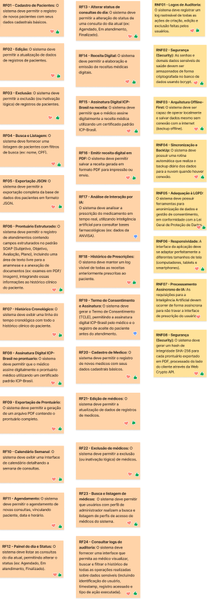

# **Planejamento e Quadro Figma**

Esta página é dedicada ao acompanhamento do planejamento estratégico do projeto ProntoCare através do nosso quadro colaborativo (Figma JamBoard). O quadro é utilizado pela equipe como artefato central para a elicitação de requisitos, mapeamento de objetivos específicos, definição de características do produto (CPs), modelagem do backlog e dinâmicas de priorização.

## :material-bulletin-board: **Quadro Colaborativo do Figma**

O quadro de desenvolvimento e organização de sprints está disponível para visualização e interação na janela abaixo. Mais do que registrar o progresso cronológico do projeto, este artefato evidencia a governança do processo ágil e desenvolvimento da matéria adotado pela equipe, demonstrando a distribuição de esforço, a dinâmica de priorização e a maturidade operacional do grupo ao longo das iterações.

<iframe style="border: 1px solid rgba(0, 0, 0, 0.1); border-radius: 8px; width: 100%; max-width: 1024px; aspect-ratio: 16/9;" src="https://embed.figma.com/board/0vnXsFutjGoQcCT6oQQ2lX/Prontuariantes?node-id=0-1&embed-host=share" allowfullscreen></iframe>

---

## :material-tag-multiple-outline: **Legenda do Estado dos Requisitos**

No quadro colaborativo, cada requisito é marcado com selos na matriz de rastreabilidade (*stamps*) específicos que indicam o progresso e o status da sua homologação:

| Selo no Quadro | Significado | Descrição do Estado |
| :---: | :--- | :--- |
| :material-thumb-up:{ .middle } | **DOD Feita** | O requisito foi totalmente desenvolvido e atende os critérios de "Definition of Done". |
| :material-heart:{ .middle } | **DOR Feita** | O requisito foi revisado, validado e atende os critérios de "Definition of Ready". |
| :material-thumb-down:{ .middle } | **Fora do MVP** | O requisito foi despriorizado ou postergado, não integrando o escopo do MVP atual. |
| *Nenhum* | **Não Iniciado** | O requisito ainda não foi planejado ou trabalhado em nenhuma Sprint da equipe. |

> :octicons-link-external-16: Você também pode visualizar o board em tela cheia diretamente no Figma clicando [aqui](https://www.figma.com/board/0vnXsFutjGoQcCT6oQQ2lX/Prontuariantes?node-id=0-1&t=7WDzylophLcdH6TL-1).

---

## :material-calendar-check: **Acompanhamento do Cronograma e Execução**

A tabela a seguir apresenta uma visão geral do cronograma planejado para o projeto ProntoCare, o status de cumprimento de cada Sprint e os links diretos para as atas e gravações das cerimônias (Planning/Review):

| Sprint | Período | Objetivo Principal | Status | Ata e Vídeos |
| :---: | :---: | :--- | :---: | :---: |
| **Sprint 0** | 19/04 - 02/05 | Configuração e arquitetura inicial | Cumprido ✅ | [:material-video-outline: Ata e Vídeos](../atas-e-videos/sprint-0.md) |
| **Sprint 1** | 03/05 - 09/05 | Cadastro de pacientes | Cumprido ✅ | [:material-video-outline: Ata e Vídeos](../atas-e-videos/sprint-1.md) |
| **Sprint 2** | 10/05 - 16/05 | Prontuário SOAP (Estrutura base) | Cumprido ✅ | [:material-video-outline: Ata e Vídeos](../atas-e-videos/sprint-2.md) |
| **Sprint 3** | 17/05 - 23/05 | Histórico clínico e protocolos | Cumprido ✅ | [:material-video-outline: Ata e Vídeos](../atas-e-videos/sprint-3.md) |
| **Sprint 4** | 24/05 - 30/05 | Integridade documental (Cadeia criptográfica) | Cumprido ✅ | [:material-video-outline: Ata e Vídeos](../atas-e-videos/sprint-4.md) |
| **Sprint 5** | 31/05 - 06/06 | Exportação de dados e Auditoria | Cumprido ✅ | [:material-video-outline: Ata e Vídeos](../atas-e-videos/sprint-5.md) |
| **Sprint 6** | 07/06 - 13/06 | Operação offline (Armazenamento local) | Cumprido ✅ | [:material-video-outline: Ata e Vídeos](../atas-e-videos/sprint-6.md) |
| **Sprint 7** | 14/06 - 20/06 | Sincronização automática | Cumprido ✅ | [:material-video-outline: Ata e Vídeos](../atas-e-videos/sprint-7.md) |
| **Sprint 8** | 21/06 - 27/06 | Agenda, Consultas e Segurança | Cumprido ✅ | [:material-video-outline: Ata e Vídeos](../atas-e-videos/sprint-8.md) |
| **Sprint 9** | 28/06 - 02/07 | Emissão de documentos, Homologação e Entrega Final | Cumprido ✅ | [:material-video-outline: Ata e Vídeos](../atas-e-videos/sprint-9.md) |

---

## :material-calendar-month: **Histórico de Revisões**

| Data | Versão | Descrição | Autor |
| :---: | :---: | :---: | :---: |
| 2026-06-30 | 1.0 | Criação do documento de planejamento com o quadro colaborativo, legenda de estados e justificativas regulatórias. | Prontuariantes |
